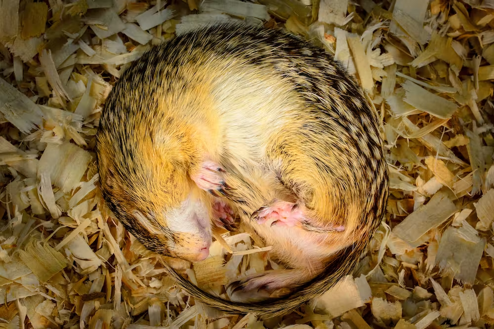
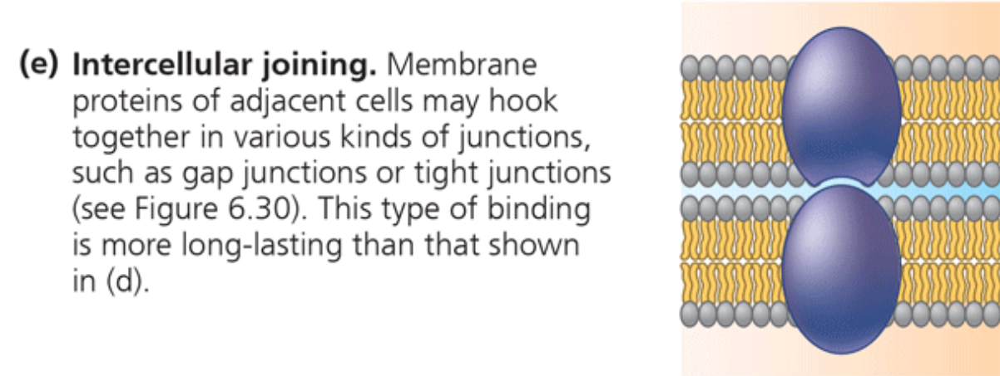

```{r setup, include=FALSE}
knitr::opts_chunk$set(echo = FALSE)

library(knitr)
```

## Cell Biology {.slide}

### 5 lectures + background reading (Campbell)

1. Cell structure (chapter 7)
2. **Cell membranes (chapter 8)**
3. Cell division (chapter 12)
4. Respiration (chapter 10)
5. Photosynthesis (chapter 11)

## Cell membranes

- Crucial structures of cells
- Makes a cell a cell!
- Also called a plasma membrane
- Fluid mosaics of lipids and proteins
- Most abundant lipids are phospholipids

## Plasma membrane

```{r, out.width = "95%", fig.align='center'}

```

## Phospholipid bilayer {.flex-cols}

- Phospholipids have hydrophilic heads and hydrophobic tails
- Forms a stable two layer membrane between aqueous compartments
- The hydrophobic tails are “shielded” from the water 

```{r, out.width = "100%", fig.align='center'}

```

## What does detergent do?

```{r, out.width = "85%", fig.align='center'}
include_graphics("./img/deter.png")
```

## Phospholipase A2 {.white-slide}

```{r, out.width = "95%", fig.align='center'}
include_graphics("./img/bee.svg")
```

## Membranes are fluid

- Membranes are dynamic!
- Phospholipids switch places laterally 107 times per second
- Some proteins also move around (others attached to plasma membrane)
- Fluidity changes with temperature

## Challenge of hibernation

```{r, out.width = "80%", fig.align='center'}

```

## Challenge of hibernation

```{r, out.width = "80%", fig.align='center'}

```

## Arctic waters

```{r, out.width = "65%", fig.align='center'}

```

## Arctic waters

```{r, out.width = "80%", fig.align='center'}

```

## Membrane synthesis {.flex-cols .white-slide}

- Synthesised in ER
- Membranes have distinct sidedness
- Cytoplasmic and extracellular faces

```{r, out.width = "100%", fig.align='center'}

```

## Membrane proteins

- Determine most of the membrane function
- Can be:
  - Integral, embedded in the membrane (including transmembrane)
  - Peripheral, loosely bound to membrane surface

## Integral membrane proteins {.flex-cols}

- Diagram shows transmembrane protein
- Internal hydrophobic region, contains α helices
- Hydrophilic regions either side of membrane
- Can be held in place by cytoskeleton

```{r, out.width = "85%", fig.align='center'}

```

## Protein function

```{r, out.width = "80%", fig.align='center'}

```

## Protein function

```{r, out.width = "80%", fig.align='center'}

```

## Protein function

```{r, out.width = "80%", fig.align='center'}

```

## Protein function

```{r, out.width = "80%", fig.align='center'}

```

## Protein function

```{r, out.width = "80%", fig.align='center'}

```

## Protein function

```{r, out.width = "80%", fig.align='center'}

```

## Membrane permeability

- Membranes are selectively permeable
- Constant flow of molecules and ions
- Examples:
  - In: nutrients, O2, inorganic ions
  - Out: waste, CO2, inorganic ions

- Molecules passively move through lipid bilayer with varying difficulty
- Membrane proteins also allow specific molecules to pass through

## Passive transport {.white-slide}

- Solutes diffuse across membranes when there is a difference in concentration
- This requires no energy
- Move towards equilibrium (equal) concentration either side of membrane
- E.g. O2 transport into cells

```{r, out.width = "80%", fig.align='center'}

```

## Passive transport using proteins

```{r, out.width = "85%", fig.align='center'}
include_graphics("./img/self_study.png")
```

## Osmosis

- Membranes that are selectively permeable produce interesting effects
- If a solute cannot move along a concentration gradient, water moves instead
- Water exchange allows equilibrium
- BUT water balance is extremely important for cells!

## Osmosis {.white-slide}

```{r, out.width = "80%", fig.align='center'}

```

## Osmosis {.white-slide}

```{r, out.width = "85%", fig.align='center'}

```

## Marine animals in freshwater?

```{r, out.width = "95%", fig.align='center'}

```

## Anadromous fish {.white-slide}

```{r, out.width = "65%", fig.align='center'}

```

## Active transport

- Sometimes cells need a different concentration of solutes inside
- This requires active pumping of solutes in/out of the cell, against their concentration gradient
- Requires energy in the form of ATP 

## Sodium-potassium pump {.white-slide}

```{r, out.width = "70%", fig.align='center'}

```

## Membrane potential

Active transport allows electrical charge to be maintained across the membrane

```{r, out.width = "85%", fig.align='center'}
include_graphics("./img/self_study.png")
```

## Bulk transport

- Some items are too big for transport through the membrane
- Require packaging in vesicles
- Exocytosis out
- Endocytosis in 

## Bulk transport {.white-slide}

```{r, out.width = "75%", fig.align='center'}

```

## Bulk transport

```{r, out.width = "90%", fig.align='center'}
include_graphics("./img/phago.png")
```

## Cell Biology

### 5 lectures + background reading (Campbell)

1. Cell structure (chapter 7)
2. **Cell membranes (chapter 8)**
3. Cell division (chapter 12)
4. Respiration (chapter 10)
5. Photosynthesis (chapter 11)

# Next time: Cell Division

### Dr. Axel Barlow: a.barlow@bangor.ac.uk
